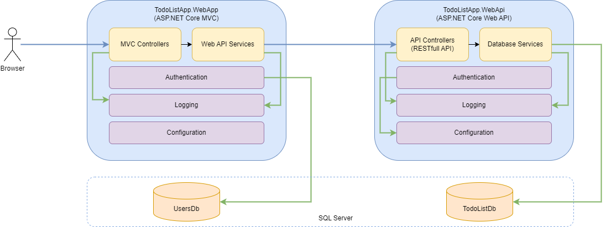

# To-do List Application

## Software Architecture

The solution must have a [3-tier architecture](https://en.wikipedia.org/wiki/Multitier_architecture):
  * The presentation tier — the web application named *TodoListApp.WebApp* that provides [browser user interface](https://en.wikipedia.org/wiki/Browser_user_interface) for the end-users allowing them to manage their to-do lists.
  * The logic (application) tier — the web API application named *TodoListApp.WebApi* that provides a RESTful API the web application must use to retrieve or save to-do lists or user's data.
  * The data tier is the relational database management system for storing to-do lists and other user's data.

The choice of database management system for the data tier depends on the platform on which the development and deployment of the application will be carried out.
  * If you are a Windows user, consider using [SQL Server Express LocalDB](https://learn.microsoft.com/en-us/sql/database-engine/configure-windows/sql-server-express-localdb?view=sql-server-ver16). You can enable this feature through the [Visual Studio Installer](https://visualstudio.microsoft.com/downloads) (see the details on the page). You may also use [SQL Server Express 2022](https://learn.microsoft.com/en-us/sql/sql-server/editions-and-components-of-sql-server-2022).
  * If you are a Mac or Linux user, consider using [PostgreSQL](https://www.postgresql.org/) or [SQLite](https://sqlite.org/).

The application must store its data in two relational databases.
  * The *UsersDb* database must be used to store Identity configuration data (user names, passwords, and profile data).
  * The *TodoListDb* database must be used to store the user data (to-do lists, tasks, tags and comments).
